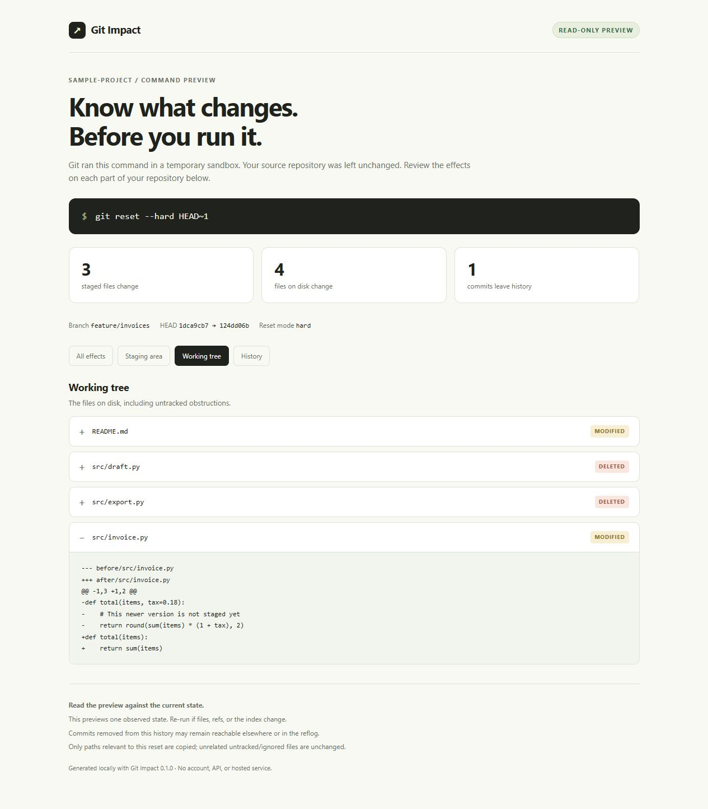

# Git Impact

**See what `git reset` would change before you run it.**

Git Impact runs the proposed reset in a temporary sandbox and reports its effects on your staging area, files on disk, and current history. Your source repository stays unchanged.

No account, API key, network access, animation engine, or Docker needed. The native executable needs Git on PATH; running from source also needs Python 3.10+.



## Download

Get the [Windows x64 executable or Python archive](https://github.com/yotam1001/git-impact/releases/latest). Extract the ZIP, check its SHA-256 checksum against the accompanying `.sha256` file, and run the executable with Git on PATH. The Python archive needs Python 3.10+ and runs with `python git-impact.pyz`.

Open the [live example report](https://yotam1001.github.io/git-impact/) to see the output before downloading. It contains synthetic data and runs entirely in your browser.

## Try the demo

The demo creates a disposable sample repository containing a staged draft, a newer unstaged edit, and an untracked note. It previews a hard reset and removes the sample repository afterward.

```powershell
.\git-impact.exe demo --html demo.html
```

From source, without installing any Python packages:

```sh
python -m gitimpact demo --html demo.html
```

Open the generated report in your browser. Or open the included [example report](docs/index.html), which was generated entirely from synthetic data.

## Preview your command

From inside a repository:

```sh
git-impact reset --hard HEAD~1
git-impact reset --mixed HEAD~2 --diff
git-impact reset --soft main --json
```

Use `git-impact.exe` or `./git-impact` when the executable is not on PATH. From the source checkout, replace `git-impact` with `python -m gitimpact` and pass `--repo` to inspect another repository:

```powershell
python -m gitimpact reset --hard HEAD~1 --repo ../my-app --html preview.html
```

Choose an HTML path **outside the inspected repository**. Existing report files are never overwritten. Omitting the reset mode uses `--mixed`, like Git itself.

Example output:

```text
GIT IMPACT
git reset --hard HEAD~1

feature/invoices: <current> -> <target>
1 commit(s) leave the current history.

STAGING AREA / 3 file(s)
  deleted  'src/draft.py'
  deleted  'src/export.py'
  modified 'src/invoice.py'

WORKING TREE / 4 file(s)
  modified 'README.md'
  deleted  'src/draft.py'
  deleted  'src/export.py'
  modified 'src/invoice.py'

Source repository unchanged. This command was run only in a temporary sandbox.
```

The HTML report contains expandable before/after diffs and filters for staging, working files, and history. It is a self-contained offline file. Reports include changed file contents and names; review them before sharing.

## What each mode does

| Mode | Current branch / HEAD | Staging area | Files on disk |
| --- | --- | --- | --- |
| `--soft` | Moves to the target | Preserved | Preserved |
| `--mixed` | Moves to the target | Reset to target versions | Preserved |
| `--hard` | Moves to the target | Reset to target versions | Reset to target versions; obstructing untracked files may be overwritten |

Git Impact shows staged and unstaged versions separately. It also identifies untracked obstructions affected by a hard reset. Unrelated untracked files are not deleted by reset. Commits leaving one branch's history may remain in other refs or the reflog; the tool does not call them permanently lost. See the [Git reset documentation](https://git-scm.com/docs/git-reset).

## How the preview works

1. Resolve your local target and inspect the index, attributes, and relevant files without refreshing or writing the source index.
2. Create a temporary Git repository with a copy of the index and relevant working files. Git reads existing objects through an alternate object directory; it does not clone, fetch, or copy the full history.
3. Refresh only the sandbox's file-stat cache so copied clean files are recognized as clean, then run the actual reset there. Source hooks, remotes, aliases, filters, credential configuration, and executable Git configuration are not copied.
4. Compare staged object IDs and working-file hashes, then check the source state again. If a change is detected during the preview, discard the report.
5. Remove the temporary sandbox, whether the preview succeeds or fails.

Soft reset avoids copying working files. Mixed and hard resets copy tracked files and any relevant obstructions. Unrelated ignored directories such as `node_modules` are not copied. A default limit of 256 MiB per snapshot and 20,000 files prevents unexpectedly large copies. Use `--max-copy-mib` and `--max-files` to adjust it. Hard reset also checks destination size before checkout. Temporary storage must accommodate the copied files and the destination checkout.

## Current scope

Version 0.1 previews **reset to a local commit/ref**, with all three modes. It never applies a command to your source repository and does not provide an apply button. Path-specific reset, `--merge`, `--keep`, other Git commands, and arbitrary shell command strings are not accepted.

Ordinary repositories and linked worktrees are supported. The preview refuses bare or unborn repositories, partial clones, sparse checkout, unmerged entries, skip-worktree/assume-unchanged flags, submodules, symlinks/junctions, nested repository obstructions, case-colliding paths/case-only renames, checkout filters including LFS, and working-tree encoding transforms. Resolve those conditions or use Git directly with an appropriate backup. Git must support `--no-lazy-fetch`, `git var GIT_ATTR_GLOBAL`, and `GIT_ATTR_SYSTEM`; the local Windows build was verified with Git 2.54.

This is a snapshot of an observed state, not a transaction with a future command. Re-run if repository state changes. Reads are not atomic, so concurrent editing cannot be ruled out completely. Objects must remain available during the operation. Each Git subprocess has a 60-second timeout. Content diffs are omitted for binary/non-UTF-8 files and files above 64 KiB; hashes and sizes still identify changes.

## Why another Git tool?

People have [asked for a dry run of hard reset](https://stackoverflow.com/questions/75483790/is-there-something-like-git-reset-hard-dry-run), and [reported wanting warnings about affected work before a coding agent resets a branch](https://github.com/anthropics/claude-code/issues/34746). Those reports motivate this workflow; they do not establish that every reported loss was caused by reset itself.

[Git-sim](https://github.com/initialcommit-com/git-sim) already visualizes Git commands and their effects. It is a broader tool with animated/image output and Manim or Docker installation. Git Impact focuses on immediate terminal output and file-level HTML diffs, with no visualization runtime. [Git-Rewind](https://github.com/neomikhe/git-rewind) and [git-recover](https://github.com/ethomson/git-recover) address recovery after mistakes. Git Impact addresses inspection before a command.

## Develop and verify

```sh
python -m unittest discover -s tests -v
python scripts/build_release.py
```

Tests create disposable repositories, compare preview results with actual Git operations, and check source files and Git metadata remain unchanged. They include distinct staged/unstaged edits, intent-to-add, deleted files, ignored/untracked obstructions, linked worktrees, line endings, binary/Unicode names, concurrent edits, and refused unsupported states. CI is configured for Windows, Linux, and macOS, with Python 3.10 coverage on Linux. Only the Windows checks have been run locally so far.

The default build produces a `.pyz` zipapp and a ZIP with an offline demo, README, license, and SHA-256 checksum. To build a native executable in an isolated build environment:

```sh
python -m pip install -r requirements-build.txt
python scripts/build_release.py --native
```

The native build is platform-specific. The release workflow can build archives on each supported operating system; artifacts require verification on that platform before publication. Run `python scripts/verify_release.py` to check archive hashes, contents, all three demo modes, and error exit codes. Nothing is uploaded or released by the local build scripts.

Git Impact is MIT licensed. Bug reports with small synthetic repositories are especially useful. Do not attach private source files or sensitive reports.
